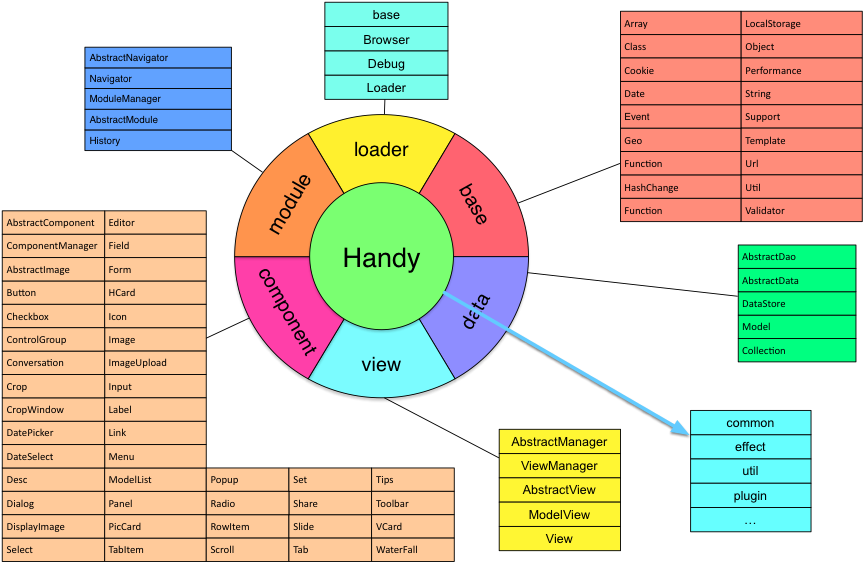

handy
=====

handy框架包括资源加载器(依赖管理)、常用工具库、面向对象编程、模板、数据模型、双向绑定视图、双向绑定组件库、模块管理、自动构建工具等内容，旨在提供一个完整的web前端开发解决方案，尤其适用于webapp及手机hybrid app(如phonegap等)的开发，秉承简洁、易用的原则进行设计，旨在提高开发效率及web性能。

加载器Loader，提供简易的前端资源管理，方便的进行资源依赖管理、打包及优化请求。

常用工具库提供浏览器环境检测、本地存储、面向对象编程、模板、校验及其他web开发常用工具。

数据模型提供前端数据的封装机统一管理，维护数据一致性，及数据变化监测、超时管理等。

视图提供前端视图实现及管理、便于模块化封装及灵活组合，结合数据模型，实现模型视图(mvvm，数据视图双向绑定)。

在视图基础上，实现了大部分前端开发需要的组件库，并且在组件层面具备跟模型的双向绑定，使实际的业务代码非常精简，易于维护（具体可查看乐加球友项目代码）。

模块管理实现SPA（单页面web应用）。

......

具体可查看文档、示例及代码（注释详尽）。

目前handy依赖于jQuery/zepto及modernizr（部分），目标是兼容IE8及以上、chrome、Firefox、Safari、opera、及移动端主流浏览器。

组件(部分)预览：

<a href="http://htmlpreview.github.io/?https://rawgit.com/zhengyinhui100/handy/blob/master/examples/component/component.html" target="_blank">组件库1</a>
 
<a href="http://htmlpreview.github.io/?https://rawgit.com/zhengyinhui100/handy/blob/master/examples/component/component2.html" target="_blank">组件库2</a>
 
<a href="http://htmlpreview.github.io/?https://rawgit.com/zhengyinhui100/handy/blob/master/examples/component/crop.html" target="_blank">图片裁剪</a>
 
<a href="http://htmlpreview.github.io/?https://rawgit.com/zhengyinhui100/handy/blob/master/examples/component/waterfall.html" target="_blank">瀑布流</a>

应用架构示例：

案例展示：

<a target="_blank" href="http://www.17lejia.com/">乐加球友(网页版、app)</a>
 
<a target="_blank" href="https://github.com/zhengyinhui100/sportapp">乐加球友前端源码</a>